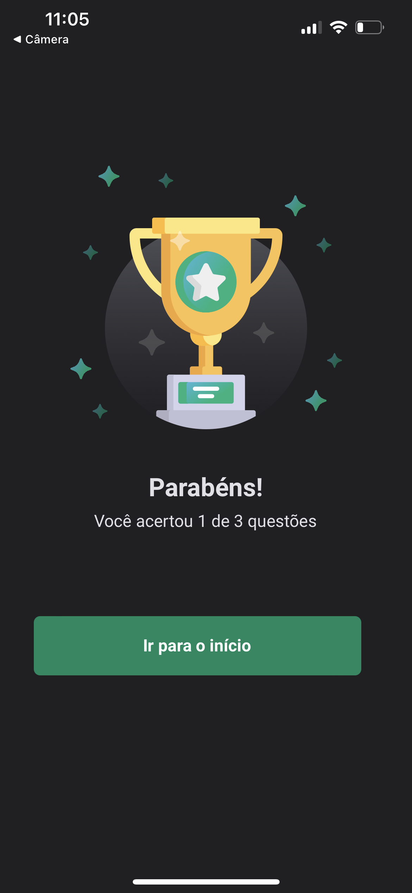

# App - Gym Train

A aprendizagem de programação pode ser desafiadora, mas também pode ser empolgante e envolvente. Neste contexto, surge uma aplicação inovadora desenvolvida em React Native: um Quiz de Programação que não apenas testa conhecimentos, mas também proporciona uma experiência única de aprendizado, focada em animações, gesture handling, e o poderoso Skia. Vamos explorar os elementos-chave desta aplicação que promove o estudo enquanto entretém.

* Tecnologias Utilizadas:
A base desta aplicação é o React Native, permitindo a criação de uma experiência nativa em dispositivos móveis. Além disso, para alcançar animações suaves e interatividade aprimorada, a biblioteca React Reanimated foi incorporada. O Skia, um motor de renderização gráfica, desempenha um papel crucial para garantir gráficos de alta qualidade e desempenho otimizado.

* Animando o Conhecimento:
As animações são mais do que apenas elementos visuais atraentes; elas são ferramentas poderosas para aprimorar a compreensão. A aplicação utiliza animações para destacar conceitos-chave, orientar o usuário durante o Quiz e proporcionar uma experiência dinâmica que mantém o interesse do estudante.

* Gesture Handling:
A interatividade é um componente vital do aprendizado. O uso do Gesture Handler permite aos usuários não apenas responderem às perguntas do Quiz, mas também interagirem intuitivamente com a interface. Gestos como deslizar, tocar e segurar são incorporados para criar uma experiência de usuário envolvente.

* Skia: Uma Janela para Gráficos Incríveis:
O Skia é empregado para renderizar gráficos de alta qualidade, proporcionando uma experiência visual impressionante. Desde animações suaves até a representação precisa de elementos gráficos, o Skia desempenha um papel essencial na entrega de uma experiência visualmente agradável e educativa.

* React Reanimated: O Poder da Reatividade:
A biblioteca React Reanimated é fundamental para criar transições e animações fluidas, aproveitando a reatividade do React Native. Isso não apenas melhora a estética da aplicação, mas também contribui para uma experiência de usuário mais natural e responsiva.

* Estímulos Sensoriais:
Para tornar a experiência mais imersiva, a aplicação incorpora efeitos sonoros que correspondem às interações do usuário. Além disso, há feedback tátil para reforçar ações, oferecendo uma experiência completa que envolve múltiplos sentidos.

## Telas:

    
    
    
    

    

    
 &nbsp;
 &nbsp;
 

  